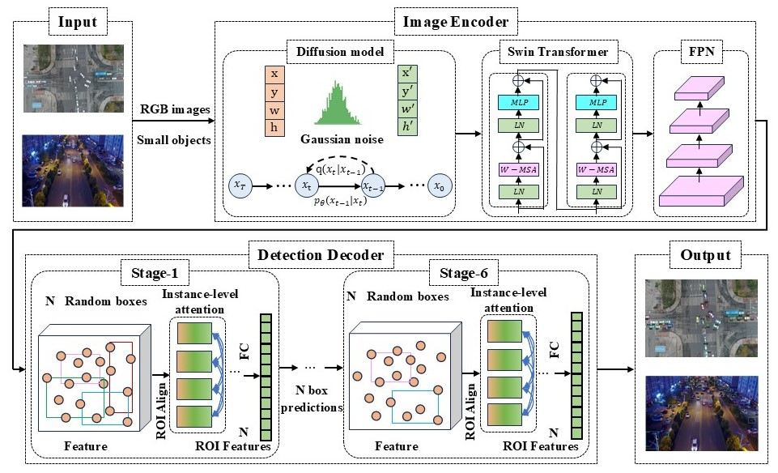

## EDSOD: An Encoder-Decoder, Diffusion-model, and Swin-Transformer-based Small Object Detector

## The whold framework of the EDSOD

## Experimental results on VisDrone and UAVDT

## Updates
- (7/2025) Code is released.
- (6/2025) Our paper has been accepted in IROS 2025.

## Getting Started

The installation instruction and usage are in [Getting Started with EDSOD](GETTING_STARTED.md).

## Models
<table>
  <tr>
    <th>Method</th>
    <th>AP</th>
    <th>AP_50</th>
    <th>AP_75</th>
    <th>Download</th>
  </tr>
    <tr>
    <td>COCO-ResNet50</td>
    <td>46.6</td>
    <td>66.9</td>
    <td>49.9</td>
    <td><a href="https://drive.google.com/file/d/1eJkZgeWkvkiBLRF0LAj4hOuDFo0vjX5_/view?usp=drive_link" download>model</a></td>
  </tr>
    </tr>
    <tr>
    <td>COCO-ResNet101</td>
    <td>47.4</td>
    <td>67.7</td>
    <td>50.8</td>
    <td><a href="https://drive.google.com/file/d/1PQVdCKZ_3Bc7gK30FkzSrN_5Z2FBUwKW/view?usp=drive_link" download>model</a></td>
  </tr>
  </tr>
    <tr>
    <td>COCO-SwinBase</td>
    <td>52.3</td>
    <td>77.3</td>
    <td>56.2</td>
    <td><a href="https://drive.google.com/file/d/1_bdHy7wjX0wQSF01AYCPXXaHgw7hI7N1/view?usp=drive_link" download>model</a></td>
  </tr>
   <tr>
    <td>VisDrone-ResNet50</td>
    <td>29.3</td>
    <td>50.6</td>
    <td>29.4</td>
    <td><a href="https://drive.google.com/file/d/1jno1ubh4mkxWH7iRgqzgZg_tevF6ILzy/view?usp=drive_link" download>model</a></td>
  </tr>
   <tr>
    <td>VisDrone-ResNet101</td>
    <td>28.4</td>
    <td>51.6</td>
    <td>30.0</td>
    <td><a href="https://drive.google.com/file/d/1mGibd5FVxar0ZnKpwB55V0qNYqNWkDGO/view?usp=drive_link" download>model</a></td>
  </tr>
  <tr>
    <td>VisDrone-SwinBase</td>
    <td>32.4</td>
    <td>55.6</td>
    <td>32.8</td>
    <td><a href="https://drive.google.com/file/d/1w47oyHjvptjZd1s4CqaYg-urIuIrZ5oV/view?usp=drive_link" download>model</a></td>
  </tr>
  <tr>
    <td>UAVDT-ResNet50</td>
    <td>17.2</td>
    <td>30.2</td>
    <td>18.0</td>
    <td><a href="https://drive.google.com/file/d/1ZwrQ7oHYAPRRTwYTVYeaMgZY3s8VOEWm/view?usp=drive_link" download>model</a></td>
  </tr>
  <tr>
    <td>UAVDT-ResNet101</td>
    <td>17.7</td>
    <td>29.2</td>
    <td>19.3</td>
    <td><a href="https://drive.google.com/file/d/19Exi-efnl2RKC-W7UXsrP2B7UeF5p5ZJ/view?usp=drive_link" download>model</a></td>
  </tr>
  <tr>
    <td>UAVDT-SwinBase</td>
    <td>20.8</td>
    <td>34.0</td>
    <td>23.0</td>
    <td><a href="https://drive.google.com/file/d/1BKGA5oNSmmRclzZ8YXiQeo4Ewa40A3Nc/view?usp=drive_link" download>model</a></td>
  </tr>
</table>

## License

This project is under the CC-BY-NC 4.0 license. See [LICENSE](LICENSE) for details.

## Acknowledgement
A large part of the code is borrowed from DiffusionDet. Much thanks for their excellent work.

<pre>
@inproceedings{chen2023diffusiondet,
  title={Diffusiondet: Diffusion model for object detection},
  author={Chen, Shoufa and Sun, Peize and Song, Yibing and Luo, Ping},
  booktitle={Proceedings of the IEEE/CVF International Conference on Computer Vision},
  pages={19830--19843},
  year={2023}
}