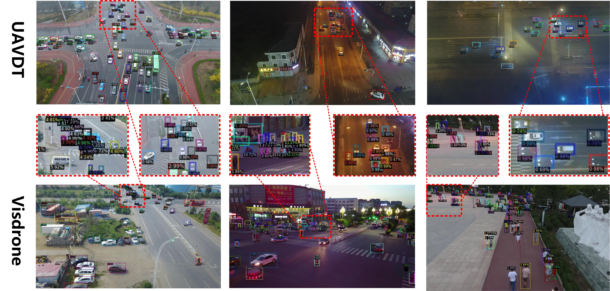

## EDSOD: An Encoder-Decoder, Diffusion-model, and Swin-Transformer-based Small Object Detector

## The whold framework of the EDSOD:

## Experimental results on VisDrone and UAVDT

## Updates
- (7/2025) Code is released.

## Getting Started

The installation instruction and usage are in [Getting Started with EDSOD](GETTING_STARTED.md).

## License

This project is under the CC-BY-NC 4.0 license. See [LICENSE](LICENSE) for details.

## Acknowledgement
A large part of the code is borrowed from DiffusionDet. Much thanks for their excellent works.

<pre>
@inproceedings{chen2023diffusiondet,
  title={Diffusiondet: Diffusion model for object detection},
  author={Chen, Shoufa and Sun, Peize and Song, Yibing and Luo, Ping},
  booktitle={Proceedings of the IEEE/CVF International Conference on Computer Vision},
  pages={19830--19843},
  year={2023}
}